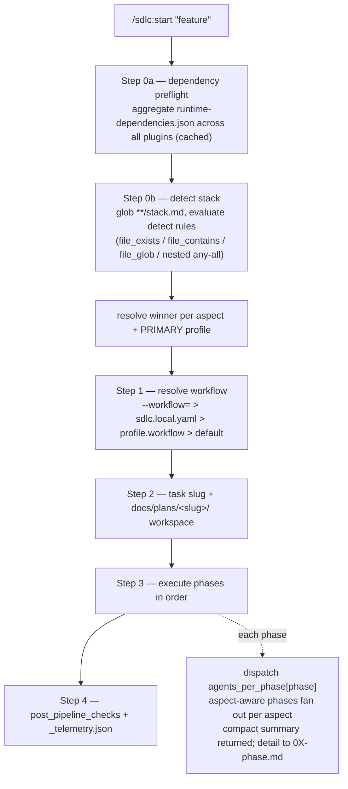
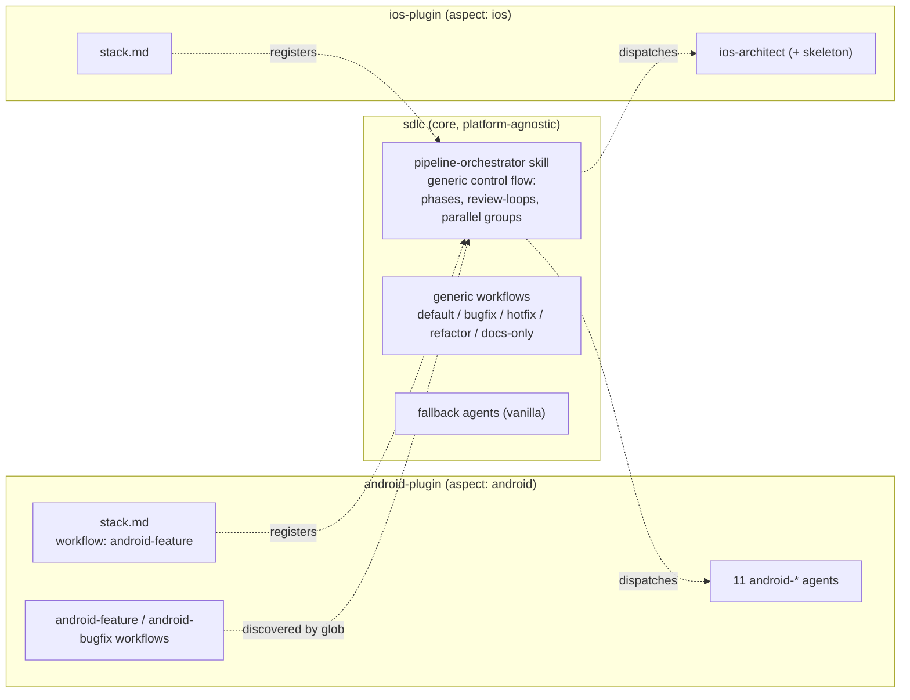
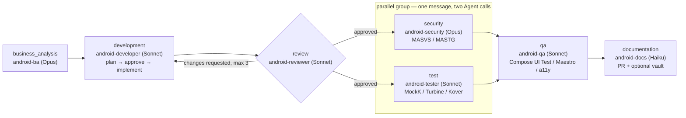

# How the system works

This document shows the moving parts of the Agentic SDLC marketplace and how a run flows through them.
The diagrams are Mermaid (rendered natively by GitHub).

## 1. Orchestration flow

What happens when you run `/sdlc:start "<feature>"`.



The core is **platform-agnostic**: it never hardcodes the phase set, the agents, or any platform standard.
Platform plugins supply all of that through their `stack.md` profile and `workflows/`.

## 2. Stack Provider Pattern



A platform plugin **registers** itself by shipping a `stack.md` (detection + phase→agent map + default workflow)
and, optionally, its own `workflows/`. The core discovers everything by globbing `**/stack.md` and
`**/workflows/*.yaml` — it is never edited to add a platform.

## 3. The Android pipeline (workflow `android-feature`)



- **review** is a *loop phase*: if `android-reviewer` requests changes, the orchestrator re-runs
  `development` (implement pass only — the plan was already approved) with the review findings injected,
  up to 3 rounds, then escalates to the user.
- **[security ‖ test]** is a *parallel group*: both agents are dispatched in a single message and must
  return before `qa` begins.
- On-demand agents (not in the pipeline; invoke directly): `android-debugger`, `android-devops`,
  `android-cicd`, `android-aar`.

## 4. Model tiers (cost discipline)

| Tier | Model | Agents |
|------|-------|--------|
| high | Opus | `android-ba`, `android-security` |
| medium | Sonnet | `android-developer`, `android-reviewer`, `android-tester`, `android-qa`, on-demand agents |
| low | Haiku | `android-docs` |

Tiers are declared in each agent's frontmatter `model:`/`effort:` and enforced by the core
`enforce-agent-model.sh` hook.

## 5. Artifacts a run produces

```
docs/plans/<task-slug>/
├── _brief.md                       # the task brief
├── 01-business-analysis.md
├── 02-development-plan.md          # plan pass (approval gate)
├── 02-development.md               # implement pass
├── 03-review.md                    # verdict (+ loop rounds)
├── 04-security.md                  # MASVS/MASTG findings
├── 04-test.md                      # unit/integration report
├── 05-qa.md                        # E2E/UI report
├── 06-documentation.md             # PR description
└── _telemetry.json                 # per-phase tokens / cost / skips
```

See [`WALKTHROUGH.md`](WALKTHROUGH.md) for a full end-to-end run of these phases on a real task.
