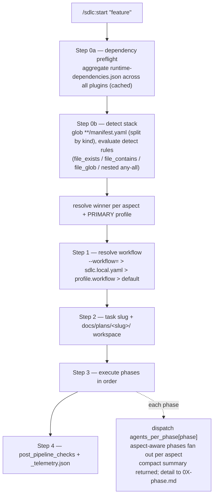
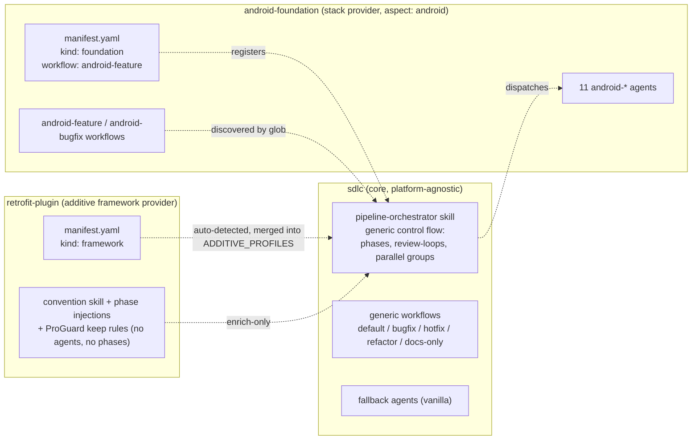
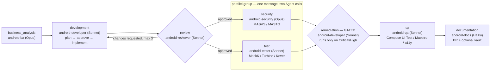

# 🧩 How the system works

This document shows the moving parts of the Agentic SDLC marketplace and how a run flows through them.
The diagrams are Mermaid (rendered natively by GitHub).

## 1. Orchestration flow

What happens when you run `/sdlc:start "<feature>"`.



The core is **platform-agnostic**: it never hardcodes the phase set, the agents, or any platform standard.
Platform plugins supply all of that through their `manifest.yaml` (`kind: foundation`) and `workflows/`.

## 2. Stack Provider Pattern



A **stack provider** **registers** itself by shipping a `manifest.yaml` (`kind: foundation` — detection +
phase→agent map + default workflow) and, optionally, its own `workflows/`. The core discovers everything by
globbing `**/manifest.yaml` and `**/workflows/*.yaml` — it is never edited to add a stack.

**Additive framework providers** (e.g. `retrofit-plugin`) ship a `manifest.yaml` with `kind: framework`
instead. They are auto-detected from the Gradle version catalog / build files, collected into the
orchestrator's `ADDITIVE_PROFILES` set, and feed their convention-skills + phase injections into the
profile merge. They are **enrich-only** — they ship no agents and own no phases, and are excluded from
per-aspect winner resolution and `PRIMARY_PROFILE` selection.

### Key principles

1. **Core never changes.** Pipeline logic lives exclusively in `pipeline-orchestrator/SKILL.md`. It has zero knowledge of any platform, library, security standard, or workflow recipe.
2. **The foundation registers itself** via `manifest.yaml` (`kind: foundation`) — it declares auto-detection rules, priority, agents per phase, an optional default workflow, and convention skills.
3. **Framework plugins attach additively** via `manifest.yaml` (`kind: framework`). They enrich existing phases (convention skill + dev/security injections + ProGuard) and ship **no agents** — they never win an aspect or own a phase. The core picks the foundation, then **delegates** framework discovery to it: the foundation collects every `kind: framework` manifest whose `enriches_aspect` (a functional category like `network`/`persistence`/`di`) is in its `hosts_aspects`, and detects them via its own `framework_detection`. Frameworks point *up* to a category, never sideways at a plugin.
4. **Priority wins.** When multiple foundations match, the highest priority takes over. Framework manifests do not compete.
5. **Everything is discovered, not hardcoded.** Manifests (`**/manifest.yaml`, split by `kind`), workflows (`**/workflows/*.yaml`), and runtime dependencies (`**/runtime-dependencies.json`) are globbed across all installed plugins.

### Stack Priority Table

Stack providers (foundations) detect by project structure (`detect`); framework providers just name a `dependency` and point at a functional category via `enriches_aspect`. The foundation hosting that category (`hosts_aspects`) declares where to search (`framework_detection`: catalog first, then build files) and the orchestrator executes it.

| Priority | Plugin              | Aspects | Detect / dependency                                                 |
| -------- | ------------------- | ------- | ------------------------------------------------------------------- |
| 0        | `vanilla` (sdlc)    | —       | `*` (always matches)                                                |
| 300      | `android-foundation`| android | `(settings.gradle.kts OR settings.gradle)` **AND** `**/*.kt`        |
| additive | `retrofit-plugin`   | —       | `dependency: com.squareup.retrofit2`                                |
| additive | `room-plugin`       | —       | `dependency: androidx.room`                                         |
| additive | `dagger-plugin`     | —       | `dependency: com.google.dagger` (Dagger + Hilt)                     |
| additive | `workmanager-plugin`| —       | `dependency: androidx.work`                                         |

### Detection rules

A profile's `detect` block supports four rule types, freely nestable via `any` / `all`:

| Rule | Matches when |
| ---- | ------------ |
| `file_exists: <path>` | the file exists |
| `file_contains: { path, pattern }` | the file at `path` matches the regex (`path` may be a glob like `**/build.gradle` — matches if any globbed file contains the pattern) |
| `file_glob: <pattern>` | ≥1 file matches the glob (variable-named / nested artifacts — module-level build files, monorepo subtrees) |
| `any: [...]` / `all: [...]` | nested OR / AND (recursive) |

This is why projects auto-detect with **no `--stack=` flag** — and why framework plugins activate automatically when their library appears in the build.

### Framework Provider Pattern (additive profiles)

A **framework plugin** ships a `manifest.yaml` with `kind: framework`. Unlike a foundation, it:

- **Owns no aspect and no agents.** It is excluded from per-aspect winner resolution and from PRIMARY_PROFILE selection — it cannot drive a phase.
- **Decorates a functional category, not a plugin.** It declares `enriches_aspect: <network|persistence|di|ui|background|analytics|architecture>` and depends on **no** sibling plugin (its `plugin.json → dependencies` lists only `sdlc`). It is never considered unless a winning foundation's `hosts_aspects` includes that category — so any foundation hosting it satisfies the contract, and frameworks stay true peers, never referencing another plugin's skill id directly.
- **Enriches existing phases.** It contributes a convention skill, `development` + `security` phase-prompt injections, ProGuard/R8 keep rules, and (optionally) post-checks — all merged into the run by the orchestrator's existing profile-merge.
- **Auto-detects** from the Gradle version catalog / build files; the foundation hosting its category consumes its guidance through that phase's existing agents — only when the library is present.

Toggle frameworks per project in `.claude/sdlc.local.yaml`:

```yaml
frameworks:
  enable: [retrofit]    # force-on even if detection missed it
  disable: [dagger]     # suppress even if detected
```

The boundary: **pinned house rules** (Coil3, Kermit, KSP, `@Serializable` routes, DataStore, Play Billing) stay in the foundation as non-negotiables; **detect-don't-impose libraries** (Retrofit, Room, Dagger/Hilt) become framework plugins. `retrofit-plugin` is the reference implementation.

> Authoring a foundation or framework plugin — including `manifest.yaml` examples and schema
> validation — is documented in [`CONTRIBUTING.md`](../CONTRIBUTING.md). Deeper architecture depth
> lives in the dev vault under `.brain/architecture/`.

### Stack Composition Examples

| Project                           | Profile(s)                              | Development dispatch                       |
| --------------------------------- | --------------------------------------- | ------------------------------------------ |
| Android app repo                  | android (300)                           | android-developer                          |
| Android app + Retrofit            | android (300) + retrofit (add.)         | android-developer, enriched by retrofit    |
| Android app + Retrofit/Room/Hilt  | android (300) + retrofit + room + dagger| android-developer, enriched by all three   |
| Unknown stack                     | vanilla (0)                             | developer (fallback)                       |

## 3. The Android pipeline (workflow `android-feature`)



- **review** is a *loop phase*: if `android-reviewer` requests changes, the orchestrator re-runs
  `development` (implement pass only — the plan was already approved) with the review findings injected,
  up to 3 rounds, then escalates to the user.
- **[security ‖ test]** is a *parallel group*: both agents are dispatched in a single message and must
  return before the gate is evaluated.
- **remediation** is a *gated phase*. `android-security` is READ-ONLY — it has no `Edit` tool and
  never touches code; it classifies findings and writes a remediation for each. Once the whole
  parallel group has returned, the orchestrator parses security's `ISSUES_FOUND:` line: on a
  Critical or High finding it dispatches `android-developer` with the security report to apply the
  fixes; otherwise the phase is skipped at zero cost. It is a one-way hand-off — security does not
  re-run afterwards.
- `android-debugger` is read-only for the same reason: it diagnoses and prescribes, and the
  `android-debug` / `android-bugfix` recipes route the fix to `android-developer` in the next
  phase, where it passes through the normal review loop.
- On-demand agents (not in the pipeline; invoke directly): `android-devops`, `android-cicd`,
  `android-aar`. `android-debugger` is on-demand **and** wired as the `debugging` phase of the
  `android-debug` recipe (manifest `agents_per_phase.debugging → android-debugger`).

The agent assigned to each phase (and the on-demand agents) is documented in
[`plugins/android-foundation/README.md`](../plugins/android-foundation/README.md#agent-roster).

### Standard 5-phase pipeline (vanilla fallback)

When no foundation matches, the platform-agnostic core runs its own 5-phase pipeline:

```
Phase 1: BA       → business-analyst (opus/high)
          ↓ docs/plans/{slug}/01-business-analysis.md
Phase 2: Dev      → [stack agent] (sonnet/medium)
          ↓ docs/plans/{slug}/02-development.md
Phase 3: QA       → qa-engineer (sonnet/medium, max 3 attempts)
          ↓ docs/plans/{slug}/03-qa.md
Phase 4: Security → security-analyst (opus/high, platform-neutral baseline; READ-ONLY)
          ↓ docs/plans/{slug}/04-security.md
Phase 5: Remediation → [stack agent] (GATED — only on Critical/High findings)
          ↓ docs/plans/{slug}/0X-remediation.md
Phase 6: Docs     → document-writer (haiku/low)
          ↓ Pull Request
```

Phase 5 is skipped at zero cost when security reports nothing at High or above, which is the
common case. It exists so that a read-only reviewer's findings reach someone who can act on them:
the security agent classifies and prescribes, the development agent applies.

### Framework enrichment (additive)

When a framework plugin's library is detected, its guidance joins the run without changing the pipeline shape. Example: on a project using Retrofit, `retrofit-plugin` adds its `retrofit-conventions` skill to the development phase and injects networking + TLS guidance into the `android-developer` and `android-security` prompts. No extra agent, no extra phase — the existing agents simply receive richer, library-specific instructions. Multiple frameworks compose: their injections concatenate deterministically.

## 3b. Project-local recipes & built-in intents

Recipe discovery reads **two sources**, project-local first: `<project>/.claude/sdlc-workflows/<name>.yaml`
takes **highest precedence** and **shadows** a plugin recipe of the same name (intentional override — not
an ambiguity halt; only two *plugins* colliding on a name halts). Project recipes validate against the same
`schemas/workflow.schema.json`; author them with `/sdlc:workflow-config`.

Additional built-in intents ship with a `match:` block for auto-selection:

- `analysis` (core) — BA → Security, **reports only** (no code, no PR); matches "analyze/audit/assess".
- `testing` (core) — QA only; backfill/verify tests; matches "test/coverage".
- `debug` (core) — Dev → QA fix-and-verify (developer does root-cause; vanilla has no debugger agent).
- `android-debug` (android) — Debugger → Dev → Review(⇄Dev ×2) → Test; wires `android-debugger` via the
  `debugging` phase. On Android both `debug` and `android-debug` match; `android-debug` wins the tie
  via `match.priority: 10` (the first tie-break rule), not by name order.

## 4. Model tiers (cost discipline)

| Tier | Model | Agents |
|------|-------|--------|
| high | Opus | `android-ba`, `android-security` |
| medium | Sonnet | `android-developer`, `android-reviewer`, `android-tester`, `android-qa`, on-demand agents |
| low | Haiku | `android-docs` |

Tiers are declared in each agent's frontmatter `model:`/`effort:` and enforced by the core
`enforce-agent-model.sh` hook.

## 5. Artifacts a run produces

```
docs/plans/<task-slug>/
├── _brief.md                       # the task brief
├── 01-business-analysis.md
├── 02-development-plan.md          # plan pass (approval gate)
├── 02-development.md               # implement pass
├── 03-review.md                    # verdict (+ loop rounds)
├── 04-security.md                  # MASVS/MASTG findings
├── 04-test.md                      # unit/integration report
├── 05-qa.md                        # E2E/UI report
├── 06-documentation.md             # PR description
└── _telemetry.json                 # per-phase tokens / cost / skips
```

See [`WALKTHROUGH.md`](WALKTHROUGH.md) for a full end-to-end run of these phases on a real task.

### Resuming an interrupted run

Every phase writes an atomic checkpoint to `docs/plans/{slug}/.checkpoint/` the moment it finishes.
If a run is interrupted — crash, `Ctrl-C`, a cost-cap abort, or a fatal halt — re-run with
`--resume` to continue from the first unfinished phase:

```
/sdlc:start "<same description>" --resume
# or target the workspace directly:
/sdlc:start --resume=<slug>
```

Completed phases are skipped and their cost is preserved in the final `_telemetry.json` (each phase
records `origin: "resumed" | "fresh"`). `--resume --dry-run` previews what would be skipped without
dispatching anything.

You can inspect a workspace's re-entry point deterministically with the linter:

```
node tools/sdlc-lint/cli.mjs resume docs/plans/<slug>
```

**Non-goal:** resume trusts the code on disk; it does not restore git state.
